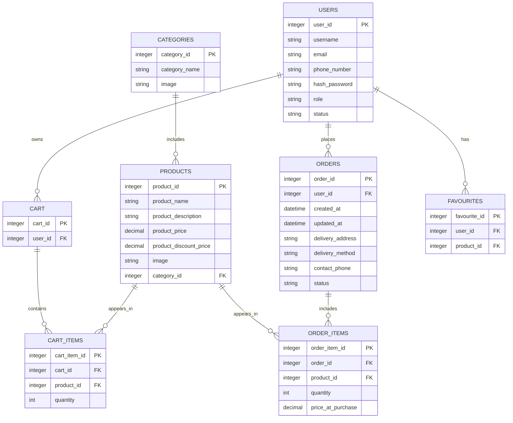

# 🛒 OnlineShop – Full REST API Backend for E-Commerce


---

# 📌 Overview

**OnlineShop** is a **full REST API backend** for an e-commerce system.  
This is a **training project**, frontend-independent, and usable by any client (Web, Mobile, Desktop) over HTTP.

It implements product catalog, categories, orders, user roles, security, and full CRUD operations.  
HTML documentation is available at the **root endpoint** of the running application.

---

# ✨ Key Features

- 🌐 Product catalog & categories management
- 🛒 Shopping cart & checkout process
- 📜 Order history and management
- 🖼 Product images upload and display
- 🔒 Authentication & role-based authorization
- 🛡 Role management (Admin, Manager, User)
- 🧩 Fully decoupled REST API architecture
- 📖 Interactive API documentation via Swagger UI
- ✅ Comprehensive unit and integration tests

---

# 🧰 Technology Stack

### Backend

- Java 17
- Spring Boot, Spring Web, Spring Security
- Spring Data JPA, Hibernate
- Maven

### Database

- PostgreSQL

### Infrastructure

- Docker & Docker Compose
- Deployment options include Heroku

---

# 🏗 Architecture Diagram

### General Structure


```
┌─────────────────┐    ┌──────────────────┐    ┌─────────────────┐
│   REST API      │◄───│   Business       │◄───│   Data Access   │
│   Controllers   │    │   Services       │    │   Layer (JPA)   │
└─────────────────┘    └──────────────────┘    └─────────────────┘
         │                       │                       │
         ▼                       ▼                       ▼
┌─────────────────┐    ┌──────────────────┐    ┌─────────────────┐
│   HTTP          │    │   Business       │    │   PostgreSQL    │
│   Clients       │    │   Logic & DTOs   │    │   Database      │
└─────────────────┘    └──────────────────┘    └─────────────────┘
```


---

# 🗄 Database Diagram (Mermaid)



---

# 📦 Entities & DTOs Overview

### User

- **Entity**: `User` – id, username, email, phoneNumber, hashPassword, role, status, cart, orders, favourites
- **DTOs**:
    - `UserRequestDto` – registration data
    - `UserResponseDto` – returned user info
    - `UserUpdateRequestDto` – update user data

### Cart & CartItem

- **Entity**: `Cart`, `CartItem`
- **DTOs**: `CartResponseDto`, `CartItemRequestDto`, `CartItemResponseDto`, `CartItemUpdateDto`

### Product & Category

- **Entities**: `Product`, `Category`
- **DTOs**: `ProductRequestDto`, `ProductResponseDto`, `ProductResponseForUserDto`, `ProductUpdateDto`, `CategoryRequestDto`, `CategoryResponseDto`, `CategoryUpdateDto`

### Order & OrderItem

- **Entities**: `Order`, `OrderItem`
- **DTOs**: `OrderRequestDto`, `OrderResponseDto`, `OrderStatusResponseDto`, `OrderItemRequestDto`, `OrderItemResponseDto`, `OrderItemUpdateDto`

### Favourite

- **Entity**: `Favourite`
- **DTO**: `FavouriteResponseDto`

### Statistic

- **DTOs**: `ProductStatisticResponseDto`, `ProfitStatisticRequestDto`, `ProfitStatisticsResponseDto`, `GroupByPeriod`

---

# 🛠 Services Overview

### UserService

- Registration, update, delete, renew user
- Email confirmation & password encoding
- Get current user / user by email

### CartService

- Get full cart, clear cart, transfer cart to order
- Save cart

### CartItemService

- Add, remove, update items in cart
- Get all items of current cart

### ProductService

- CRUD operations for products
- Set discount, get products by criteria, get top discounted

### CategoryService

- CRUD operations for categories
- Get category by ID or name

### OrderService

- Save order, update delivery, cancel order, confirm payment
- Get order by ID, orders by user
- Update order status, get order status DTO

### OrderItemService

- Add, delete, update items in order
- Get current open order

### FavouriteService

- Add, delete, get favourites

### StatisticService

- Top sold, cancelled, pending products
- Profit statistics by period

### ConfirmationCodeService

- Generate, save, send confirmation codes
- Confirm code, delete by user

---

# 📘 API Documentation

- **Swagger UI**: `http://localhost:8080/swagger-ui/`
- **HTML Docs**: `http://localhost:8080/` or `https://api.onlineshop.name/`

---

# ⚙ **Installation**

### Clone repository
```bash
git clone https://github.com/YuriyDolgikh/onlineshop.git
cd onlineshop

```

---

# ▶ **Local Run**
1. Install Java 17 & Maven  
2. Configure PostgreSQL in `application.properties`  
3. Run from IDE or:

```bash
mvn spring-boot:run
```

---

# ▶ **Run with Maven**
```bash
mvn clean install
mvn spring-boot:run
```

---

# 🐳 **Run with Docker**
```bash
docker-compose up --build
```

---

# 🔧 **Configuration**
File:
```
src/main/resources/application.properties
```

Example:
```properties
server.port=8080

spring.datasource.url=jdbc:postgresql://localhost:5432/onlineshop
spring.datasource.username=your_user
spring.datasource.password=your_password

spring.jpa.hibernate.ddl-auto=update
```

---

# 🧪 **Testing**
Run all tests:
```bash
mvn test
```

---

# ☁ **Deployment**
Previously deployed to Heroku:
```
https://api.onlineshop.name
```

Suitable for:
- VPS (Docker)
- Railway / Render / Fly.io
- Kubernetes

---

# 📂 **Project Structure**

```
onlineshop/
 ├── src/
 │   ├── main/
 │   │   ├── java/
 │   │   ├── resources/
 │   │   │   ├── application.properties
 │   │   │   ├── static/ (HTML documentation)
 │   │   │   └── templates/
 │   ├── test/
 ├── docker-compose.yml
 ├── Dockerfile
 ├── pom.xml
 └── README.md
```

---

# 🎉 Summary

A complete **full-stack-ready REST backend** for an e-commerce system with:

- Clean architecture
- Strong security
- Extensible design
- Fully documented API
- DTO & Entity clarity
- Service overview  
