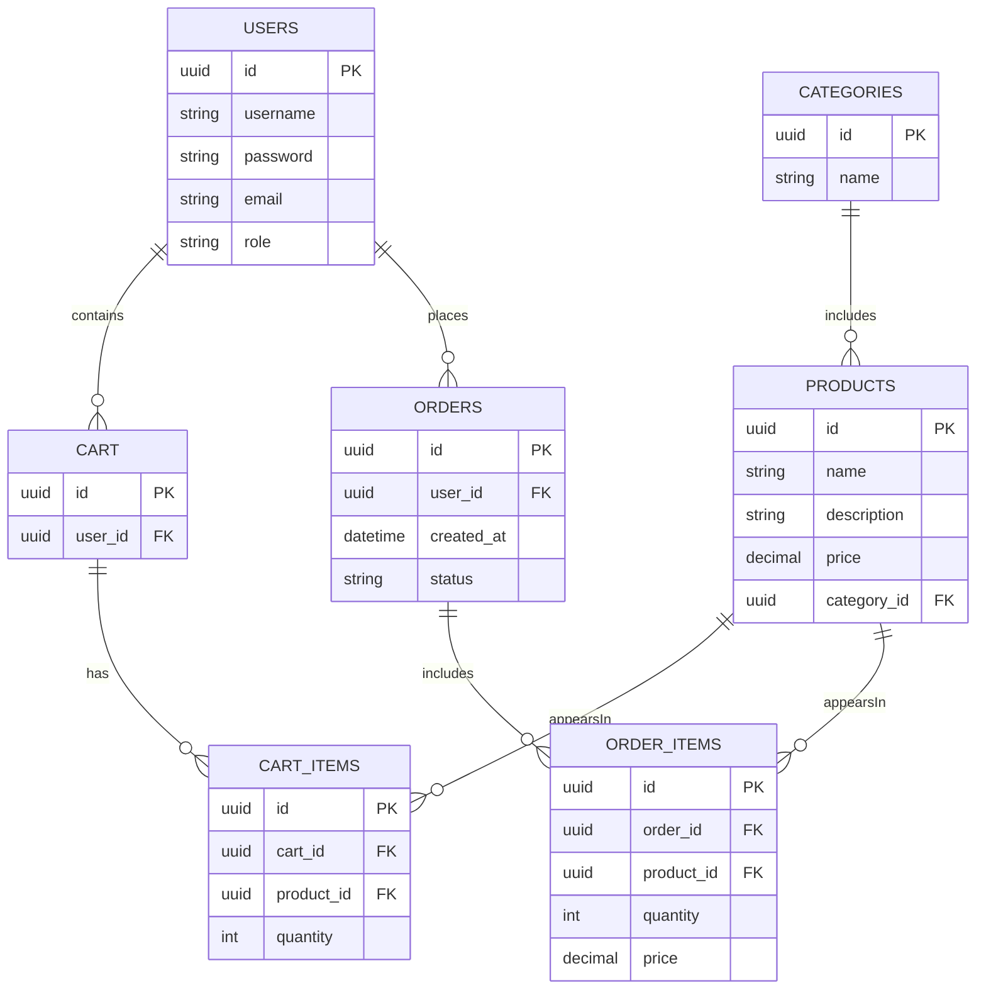

# 🛒 **OnlineShop – Full REST API Backend for E-Commerce**

```
   ___        _ _             _____ _                 
  / _ \ _   _(_) |_ _   _    / ____| |                
 | | | | | | | | __| | | |  | (___ | |__   ___  _ __  
 | | | | | | | | |_| |_| |   \___ \| '_ \ / _ \| '_ \ 
 | |_| | |_| | |  _|  _  |   ____) | | | | (_) | |_) |
  \__\_\\__,_|_|\__|_| |_|  |_____/|_| |_|\___/| .__/ 
                                                |_|    
```


---

# 📌 **Overview**

**OnlineShop** is a **full REST API backend** for an e-commerce system.  
This is a **training project**, frontend-independent, and usable by any client (Web, Mobile, Desktop) over HTTP.

It implements product catalog, categories, orders, user roles, security, and full CRUD operations.

HTML documentation is available directly at the **root endpoint** of the running application.

---

# ✨ **Features**
- Product catalog & categories  
- Shopping cart & checkout  
- Order history  
- Product images  
- Authentication & authorization  
- Role-based access (**Admin**, **Manager**, **User**)  
- Fully decoupled REST backend  
- Swagger API documentation  
- Integration & unit tests  
- Docker & PostgreSQL support  

---

# 🧰 **Technology Stack**

### Backend
- Java **17**  
- Spring Boot  
- Spring Web  
- Spring Security  
- Spring Data JPA  
- Hibernate  
- Maven  

### Database
- **PostgreSQL**  

### Infrastructure
- Docker  
- Docker Compose  
- Heroku (legacy deployment)

---

# 🏗 **Architecture**

### General Structure
```
Controller → Service → Repository → Database
         ↑             ↑            ↑
     Security       DTOs        Entities
```

### Mermaid Architecture Diagram
```mermaid
flowchart TD
    Client[Frontend Client] --> API[REST API (Spring Boot)]
    API --> Auth[Spring Security]
    API --> Service[Business Logic]
    Service --> Repo[Repository Layer]
    Repo --> DB[(PostgreSQL Database)]
```

---

# 🗄 **Database Diagram (Mermaid)**



---

# 📘 **API Documentation**

### Swagger UI  
```
http://localhost:8080/swagger-ui/
```

### HTML Documentation  
Available at the root URL when the server is running:
```
http://localhost:8080/
```
Or at the following URL address:
```
https://api.onlineshop.name/
```

---

# ⚙ **Installation**

### Clone repository
```bash
git clone https://github.com/YuriyDolgikh/onlineshop.git
cd onlineshop
```

---

# ▶ **Local Run**
1. Install Java 17 & Maven  
2. Configure PostgreSQL in `application.properties`  
3. Run from IDE or:

```bash
mvn spring-boot:run
```

---

# ▶ **Run with Maven**
```bash
mvn clean install
mvn spring-boot:run
```

---

# 🐳 **Run with Docker**
```bash
docker-compose up --build
```

---

# 🔧 **Configuration**
File:
```
src/main/resources/application.properties
```

Example:
```properties
server.port=8080

spring.datasource.url=jdbc:postgresql://localhost:5432/onlineshop
spring.datasource.username=your_user
spring.datasource.password=your_password

spring.jpa.hibernate.ddl-auto=update
```

---

# 🧪 **Testing**
Run all tests:
```bash
mvn test
```

---

# ☁ **Deployment**
Previously deployed to Heroku:
```
https://api.onlineshop.name
```

Suitable for:
- VPS (Docker)
- Railway / Render / Fly.io
- Kubernetes

---

# 📂 **Project Structure**

```
onlineshop/
 ├── src/
 │   ├── main/
 │   │   ├── java/
 │   │   ├── resources/
 │   │   │   ├── application.properties
 │   │   │   ├── static/ (HTML documentation)
 │   │   │   └── templates/
 │   ├── test/
 ├── docker-compose.yml
 ├── Dockerfile
 ├── pom.xml
 └── README.md
```

---

# 🎉 **Summary**
A complete full-stack-ready REST backend for an e-commerce system,  
featuring clean architecture, strong security, and extensible design.

